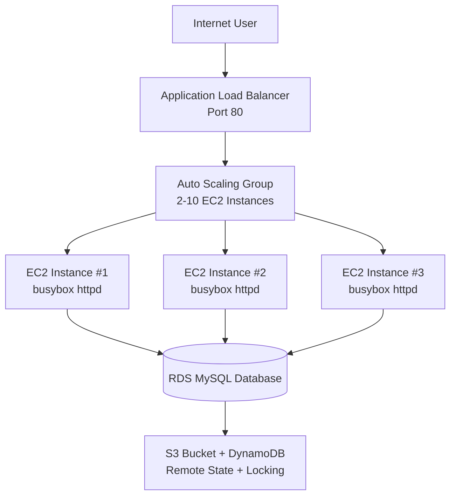

# 🏗️ Production Terraform Infrastructure

[](https://terraform.io)
[](https://aws.amazon.com)
[](LICENSE)

## 📋 Overview

This project demonstrates **production-ready AWS infrastructure** using Terraform with proper **state isolation** and **component separation**.

### What's Deployed

| Component | Description |
|-----------|-------------|
| **Global S3 Backend** | Remote state storage with DynamoDB locking |
| **RDS MySQL Database** | Managed database in staging environment |
| **Web Server Cluster** | Auto Scaling Group + ALB + EC2 instances |

## 🏗️ Architecture Diagram



## 🏆 Skills Demonstrated

| Skill | Implementation |
|-------|----------------|
| **State Isolation** | Separate state files per environment/component |
| **Remote State** | S3 backend with DynamoDB locking |
| **Cross-Component Communication** | `terraform_remote_state` data source |
| **Secrets Management** | Environment variables for sensitive data |
| **High Availability** | Multi-AZ deployment, Auto Scaling |
| **Load Balancing** | Application Load Balancer with health checks |

## 📁 Project Structure

**Deploy in this order:**

1. `global/s3/` → State storage (S3 + DynamoDB)
2. `stage/data-stores/mysql/` → Database (RDS)
3. `stage/services/webserver-cluster/` → Web servers (ALB + ASG)

**Production ready:** `prod/` folder mirrors `stage/` for production deployment

**Key files:**
- `main.tf` - Infrastructure resources
- `outputs.tf` - Exported values (DB address, ALB DNS)
- `variables.tf` - Input variables
- `user-data.sh` - EC2 bootstrap script

## 🚀 Quick Start

### Prerequisites

- AWS CLI configured (`aws configure`)
- Terraform >= 1.5
- SSH key pair named `terraform-key` in AWS EC2

### 1. Set Database Credentials
```Bash
# Step 1: Set your database password (type this exactly)
export TF_VAR_db_username="admin"
export TF_VAR_db_password="MyPass123"

# Step 2: Go to the state storage folder
cd ~/terraform-project/global/s3

# Step 3: Deploy state storage
terraform init
terraform apply

# Step 4: Go to database folder
cd ~/terraform-project/stage/data-stores/mysql

# Step 5: Deploy database
terraform init
terraform apply

# Step 6: Go to web server folder
cd ~/terraform-project/stage/services/webserver-cluster

# Step 7: Deploy web server
terraform init
terraform apply

# Step 8: Get your website URL
terraform output alb_dns_name
```
